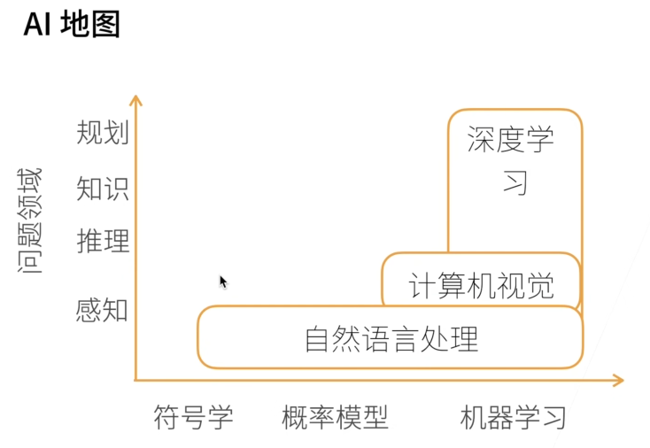
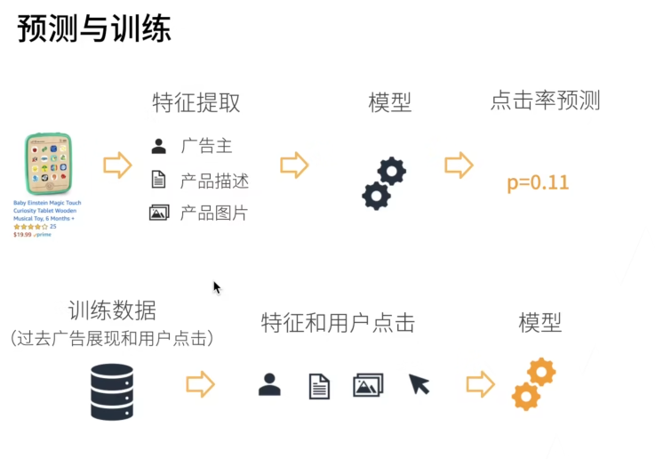

# 李沐《动手学深度学习》PyTorch版

## #00 预告【动手学深度学习v2】

- ### 深度学习的核心是神经网络

- ### 神经网络是一个非常灵活的框架，可组合不同的神经元

- ### 神经网络可看成一门计算机语言

- 教材https://zh.d2l.ai/

- 课程主页：https://courses.d2l.ai/zh-v2

- 课程论坛：https://discuss.d2l.ai/c/chinese-version/16

- Pytorch论坛：https://discuss.pytorch.org/

- 源代码https://github.com/d2l-ai/d2l-zh

## #01 课程安排

- ### 介绍深度学习经典和最新模型：LeNet,ResNet,LSTM,BERT...

- ### 机器学习基础知识：损失函数，目标函数，过拟合，优化

- ### 实践：Pytorch实现，真实数据集上体验算法效果

  - 深度学习基础——线性神经网络，多层感知机
  - 空间上：卷积神经网络——LeNet,AlexNet,VGG,Inception,ResNet
  - 时间上：循环神经网络——RNN,GRU,LSTM,seq2seq
  - 注意力机制——Attention,Transformer
  - 优化算法——SGD,Momentum,Adam
  - 高性能计算——并行，多GPU，分布式
  - 计算机视觉——目标检测，语义分割
  - 自然语言处理——词嵌入，BERT

## #02 深度学习简单介绍



- 一些应用：图片分类， 物体检测和分割，样式迁移（类似加滤镜），人脸合成，文字生成图片，文字生成（如回答问题），无人驾驶

- 案例研究——广告点击（搜baby toy,怎么给一些广告？）

  - 触发：搜索baby toy

  - 点击率估计：p=0.11,p=0.08.....

  - 排序：点击率*竞价

    


​                      简单理解一下      领域专家：甲方                数据科学家：乙方

## #03 安装

- 本地安装（先讲最简单的本地CPU安装，后面会使用GPU）
  - 【可选】使用conda/miniconda环境
    - conda env remove d2l-zh
    - conda create -n d2l-zh -y python=3.8 pip
    - conda activate d2l-zh
  - 安装需要的包
    - pip install -y jupyter d2l torch torchvision
  - 下载代码并执行
    - wget https://zh-v2.d2l-zh.zip
    - unzip d2l-zh.zip
    - jupyter notebook
  
- 注：我用的windows。可以在本地安装Anaconda和Pycharm，用anaconda创建一个虚拟环境，在虚拟环境里pip install torch ，pip install torchvision ，pip install d2l装好pytorch和d2l库，然后在pycharm里引用即可，在这个虚拟环境下打开课程文件夹的jupyter note文件就可以

- 注：下载慢的问题。如果在Windows系统中找不到`pip`配置文件，可以按照以下步骤手动创建：

  ### 1. **找到用户的主目录**

  - 按下`Win + R`键，打开“运行”对话框。
  - 输入`%USERPROFILE%`，然后按`Enter`键。这将打开用户的主目录。

  ### 2. **创建`pip`文件夹**

  - 在用户的主目录中，检查是否存在一个名为`pip`的文件夹。
  - 如果不存在，右键点击空白处，选择“新建” -> “文件夹”，并将新文件夹命名为`pip`。

  ### 3. **创建`pip.ini`文件**

  - 在`pip`文件夹中，右键点击空白处，选择“新建” -> “文本文档”。
  - 将新建的文本文档重命名为`pip.ini`。

  ### 4. **编辑`pip.ini`文件**

  - 右键点击`pip.ini`文件，选择“编辑”。

  - 在打开的文本编辑器中，添加以下内容：

    复制

    ```
    [global]
    index-url = https://pypi.tuna.tsinghua.edu.cn/simple
    ```

  - 保存并关闭文件。

  ### 5. **验证配置**

  打开命令提示符（`cmd`）。

  输入以下命令验证配置是否生效：

  ```
  pip config list
  ```

  确保输出显示您添加的镜像源。

- 注：pip install d2l时，报错。这是因为某些包（如`pywinpty`）需要Rust来编译其扩展。

  ### 1. **安装Rust和Cargo**

  - **Windows系统**：

    1. 访问[Rust官方网站](https://rustup.rs/)。
    2. 下载并运行`rustup-init.exe`。
    3. 按照安装程序的提示完成安装。

  - **Linux或macOS系统**： 在终端中运行以下命令：

    ```
    curl --proto '=https' --tlsv1.2 -sSf https://sh.rustup.rs | sh
    ```

    然后按照屏幕上的提示完成安装。

  ### 2. **验证Rust和Cargo安装**

  - 安装完成后，打开命令提示符（Windows）或终端（Linux/macOS），并运行以下命令验证安装：

    复制

    ```
    rustc --version
    cargo --version
    ```


## #04 数据操作 + 数据预处理


注：数组下标从0开始。【】内逗号前面是行，逗号后面是列。1:3表示从第一行到第二行，右边是开区间！如只为冒号：表示全取。如为双冒号：：3表示3行一跳。取0，3，6......行

### 数据操作

- 首先导入torch(尽管它被称为PyTorch)

- ```
  import torch
  x=torch.arange(12)
  x
  x.shape
  x.numel()
  X=x.reshape(3,4)
  
  torch.zeros((2,3,4))
  torch.ones((2,3,4))
  
  torch.tensor([[2,1,4,3],[1,2,3,4],[4,3,2,1]])
  torch.tensor([[2,1,4,3],[1,2,3,4],[4,3,2,1]]).shape
  torch.tensor([[[2,1,4,3],[1,2,3,4],[4,3,2,1]]]).shape
  torch.tensor([[[2,1,4,3],[1,2,3,4],[4,3,2,1]]]).numel()
  
  x=torch.tensor([1.0,2,4,8])
  y=torch.tensor([2,2,2,2])
  x+y,x-y,x*y,x/y,x**y
  torch.exp(x)
  
  X=torch.arange(12,dtype=torch.float32).reshape((3,4))
  Y=torch.tensor([[2.0,1,4,3],[1,2,3,4],[4,3,2,1]])
  torch.cat((X,Y),dim=0),torch.cat((X,Y),dim=1)
  X==Y
  X.sum(),Y.sum()
  
  a=torch.arange(3).reshape((3,1))
  b=torch.arange(2).reshape((1,2))
  a,b,a+b,a-b,a*b,a/b,a**b
  
  X[-1],X[1:3],X[-1,1:2]
  X[1,2]=9
  X[0:2,:]=12
  
  before=id(Y)
  Y=Y+X
  id(Y)==before
  
  before=id(Y)
  Y+=X
  id(Y)==before
  
  z=torch.zeros_like(Y)
  id(z)
  z[:]=X+Y
  id(z)
  
  X
  A=X.numpy()
  B=torch.tensor(A)
  type(A),type(B)
  
  a=torch.tensor([3.5])
  a,a.item(),float(a),int(a)
  ```
  
- 注：张量torch.tensor()      连续整数张量torch.arange()       全零张量torch.zeros     全1张量torch.ones()     张量拼接torch.cat((X,Y),dim=0)

​               形状.shape    元素数量.numel()   改变形状.reshape()  形状模仿torch.zeros_like()  唯一标识 id()    显式赋值 增强赋值 原地操作

​               张量的加减乘除乘方   张量与numpy类型互相转换    张量变标量      张量赋值与取值

### 数据预处理（创建读取csv文件，做特征预处理，变成pytorch用的张量形式）

```
import os
os.makedirs(os.path.join('..','data'),exist_ok=True)
data_file=os.path.join('..','house.csv')
with open(data_file,'w') as f:
	f.write('NumRooms,Alley,Price\n')
	f.write('NA,Pave,127000\n')
	f.write('2,NA,106000\n')
	f.write('4,NA,178100\n')
	f.write('NA,NA,141000\n')

import pandas as pd
data=pd.read_csv(data_file)
print(data)
data
inputs,outputs=data.iloc[:,0:2],data.iloc[:,2]
inputs=inputs.fillna(inputs.mean(numeric_only=True))
inputs
inputs=pd.get_dummies(inputs,dummy_na=True,dtype=float)
inputs
outputs

import torch
X,y=torch.tensor(inputs.values),torch.tensor(outpouts.values)
X,y
```

- 注：os创建文件：os.makedirs()   os.path.join()        with open(data_file,'w') as f

  ​        pandas读文件改值：pd.read_csv()  inputs,outputs=data.iloc[],data.iloc[]

  ​						.fillna()    .mean()      pd.get_dummies()

​	       pytorch改为张量形式：torch.tesor(inputs.values)

## #05 线性代数

### 一.简单线性代数

#### ①标量


 		标量的长度就是绝对值

#### ②向量


​	

```
	   向量（既是行向量也是列向量）的长度是向量的每个元素的平方求和再开根号（类似勾股定理）

	   向量长度永远大于等于0
	   
	   两个向量的长度小于等于a的长度+b的长度
	   
	   a为标量，可以提出来
```


#### ③矩阵


```
向量与矩阵相乘：一个向量通过矩阵乘法变成另外一个向量
矩阵乘法反应了一种线性变换（矩阵是把空间进行扭曲）
```


```
矩阵乘法参考宋浩：如 A(3*4)*B(4*6)=C(3*6)
```


```
矩阵长度：范数，一般用F范数（A的所有元素全部平方的和再开根号，类似勾股定理）
```

#### ④特殊矩阵


```
对称，反对称，正定矩阵（这里不会用到太多）

正定矩阵在数学和工程领域中具有重要的应用。它们在优化、统计、机器学习和物理等多个领域中起着关键作用。
定义和性质：
正定矩阵是一个对称矩阵，其所有特征值均为正数。具体来说，对于任意非零向量 ( x )，如果 ( x^T A x > 0 )，则矩阵 ( A ) 为正定矩阵

正定矩阵具有以下几个重要性质：
1.行列式为正：正定矩阵的行列式恒为正。
2.逆矩阵也是正定的：如果 ( A ) 是正定矩阵，则其逆矩阵 ( A^{-1} ) 也是正定的。
3.矩阵和的正定性：两个正定矩阵的和仍然是正定矩阵。
4.正实数乘积的正定性：正实数与正定矩阵的乘积仍然是正定矩阵

应用：
正定矩阵在许多实际应用中非常重要。例如：
1.优化问题：在凸优化中，目标函数的 Hessian 矩阵是正定的，这保证了目标函数是凸的，从而确保了全局最优解的存在。
2.统计学：在多元统计分析中，协方差矩阵是正定的，这确保了数据的方差和协方差是正的。
3.机器学习：在支持向量机（SVM）中，核函数生成的矩阵需要是正定的，以确保算法的正确性和稳定性。
4.物理学：在物理学中，正定矩阵用于描述系统的稳定性和能量最小化

判定方法：
判定一个矩阵是否为正定矩阵的方法有多种：
1.特征值法：计算矩阵的所有特征值，如果所有特征值均为正，则该矩阵为正定矩阵。
2.主子式法：计算矩阵的各阶主子式，如果所有主子式均大于零，则该矩阵为正定矩阵
```


```
最核心的问题是：什么样的矩阵才能称作正交矩阵？

第一点：必须是一个方阵，即n行n列；

第二点：矩阵中的每一列若视作向量，则这些向量均两两相互垂直；

第三点：矩阵中的每一列若视作向量，则这些向量的长度均为1；

同时满足这3点，即为一个正交矩阵。让我们来看一些例子：
```


```
置换矩阵是线性代数中的一个概念，它是通过对单位矩阵的行进行重新排列而得到的方阵。每个置换矩阵的每一行和每一列都恰好有一个1，其余位置都是0。
	示例

例如，对于一个3阶的置换矩阵，它可能看起来像这样：

# 一个3阶置换矩阵的例子
P = [[0, 1, 0],
[1, 0, 0],
[0, 0, 1]]
这个置换矩阵表示第一行和第二行进行了交换。
```


### 二.线性代数实现

```
import torch 
x=torch.tensor([3.0])
y=torch.tensor([2.0])
x+y,x*y,x/y,x**y

x=torch.arange(4)
x[3],len(x),x.shape

A=torch.arange(20).reshape(5,4)
A.T
B=torch.tensor([[1,2,3],[2,0,4],[3,4,5]])
B==B.T

X=torch.arange(24).reshape(2,3,4)
X
A=torch.arange(20,dtype=torch.float32).reshape(5,4)
B=A.clone()
torch.set_printoptions(threshold=10000)
A,A+B,A+B+B,A*B，2*A，(2*A).shape,2+A,2-A

A=torch.arange(20*2,dtype=torch.float32).reshape(2,5,4)
A,A.shape,A.sum()

A_sum_axis0=A.sum(axis=[0,1])
A,A_sum_axis0,A_sum_axis0.shape

sum_A=A.sum(axis=1,keepdims=True)
sum_A,A/sum_A

A,A.sum(axis=0),A.cumsum(axis=0)

x=torch.arange(4,dtype=torch.float32)
y=torch.ones(4,dtype=torch.float32)
x,y,torch.dot(x,y),torch.sum(x*y)

u=torch.tensor([3.0,-4.0])
torch.norm(u)
torch.abs(u).sum()
torch.norm(torch.ones((4,9)))


```

- 注：标量推向量，向量推矩阵，矩阵推更多轴数据结构

  ####         标量：

  ​		直接a=2或a=torch.tensor([2])等价

  #### 	向量：

  ​                点积（按元素乘法的和）(等价于哈达玛积再求和)：torch.dot(x,y)  torch.sum(x*y)

  #### 	矩阵：

  ​                   A*B（哈达玛积，按元素乘法）  a*B(标量乘以矩阵，还有加减乘等操作)   

  ​                   Ax(矩阵向量积，x是列向量)： torch.mv(A,x)     矩阵矩阵积：torch.mm(A,B)      这俩是数学上的

  ​		ps:有时矩阵相关运算打印不全，可以设置打印参数torch.set_printoptions(threshold=10000)  

  ​		

  #### 	更多轴(axis)的数据结构：

  ​                                          任意张量的形、元素和、平均值： 

  ​	                           	A.shape      A.sum()         A.mean(),A.sum()/A.numel(),A.sum()/A.shape[]

  ​					   对哪一维求和就是消除哪一维，看剩下什么:A_sum_axis0=A.sum(axis=0)

  ​														     A_sum_axis=A.sum(axis=[0,1])

  ​                                           求和后保留维度方便计算：sum_A=A.sum(axis=1,keepdims=True)

  ​					   按某个轴的累计求和：如后一列（块，行）为前面所有列（块,行）相加

  ​										A.cumsum(axis=0)

  ​      				      对哪一维求平均值：A.mean(axis=0),即A.sum(axis=0)/A.shape[0]

  #### 	L2范数(norm)：

  ​			向量元素平方和的平方根（类似勾股定理）

   			u=torch.tensor([3.0,-4.0])   

  ​			 torch.norm(u)

  ####       L1范数：

  ​			向量元素的绝对值之和：

  ​			torch.abs(u).sum()	

####              F范数：

​				矩阵元素的平方和的平方根（类似勾股定理，等价于把矩阵拉成向量来求范数）

​				torch.norm(torch.ones((4,9)))


## #06 矩阵计算

### ①倒数


### ②梯度（y是x的函数，搞对形状）


